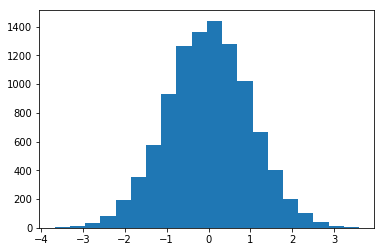
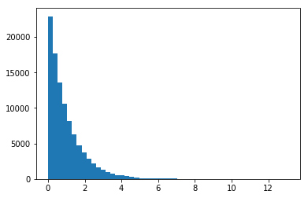
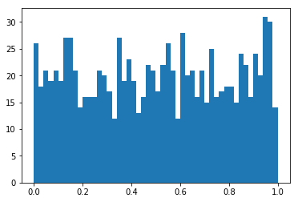
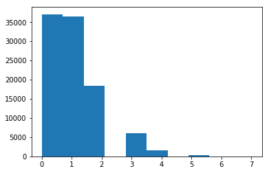

# Distributions

<div class="alert alert-success">
Probability distributions reflect the probabilities of occurence for the possible outcomes of a function / data source. 
</div>

<div class="alert alert-info">
Probability distributions on 
<a href="https://en.wikipedia.org/wiki/Probability_distribution" class="alert-link">wikipedia</a>.
If you want a more general refresher on probability / distributions, check out this
<a href="https://betterexplained.com/articles/a-brief-introduction-to-probability-statistics/" class="alert-link">article</a>.
</div>


{:.input_area}
```python
%matplotlib inline

import numpy as np
import matplotlib.pyplot as plt
```


### Probability Distributions

Typically, given a data source, we want to think about and check what kind of probability distribution our data sample appears to follow. More specifically, we are trying to infer the probability distribution that the data generator follows, asking the question: what function could it be replaced by?

Checking the distribution of data is important, as we typically want to apply statistical tests to our data, and many statistical tests come with underlying assumptions about the distributions of the data they are applied to. Ensuring we apply appropriate statistical methodology requires thinking about and checking the distribution of our data. 

Informally, we can start by visualizing our data, and seeing what 'shape' it takes, and which distribution it appears to follow. More formally, we can statistically test whether a sample of data follows a particular distribution.

Here we will start be visualizing some of the most common distributions. Scipy (scipy.stats) has a series of code and functions for working with, and generating different distributions - all with a consistent API. We will generate synthetic data from different underlying distributions, and do a quick survey of how they look, plotting histograms of the generated data. 

You can use this notebook to explore different parameters to get a feel for these distributions. For further exploration, explore plotting the probability density functions of each distribution. 

## Uniform Distribution

<div class="alert alert-success">
A uniform distribution is a distribution in which each possible value is equally probable. 
</div>

<div class="alert alert-info">
Uniform distribution on
<a href="https://en.wikipedia.org/wiki/Uniform_distribution_(continuous)" class="alert-link">wikipedia</a>.
</div>


{:.input_area}
```python
from scipy.stats import uniform
```


{:.input_area}
```python
dat = uniform.rvs(size=10000)
```


{:.input_area}
```python
plt.hist(dat);
```


## Normal Distribution

<div class="alert alert-success">
The Normal (also Gaussian, or 'Bell Curve') distribution, is a distribution defined by it's mean and standard deviation.
</div>

<div class="alert alert-info">
Normal distribution on 
<a href="https://en.wikipedia.org/wiki/Normal_distribution" class="alert-link">wikipedia</a>.
</div>


{:.input_area}
```python
from scipy.stats import norm
```


{:.input_area}
```python
dat = norm.rvs(size=10000)
```


{:.input_area}
```python
plt.hist(dat, bins=20);
```





## Bernouilli Distribution

<div class="alert alert-success">
A Bernouilli Distribution is a binary distribution - it takes only two values (0 or 1), with some probably 'p'. 
</div>

<div class="alert alert-info">
Bernouilli distribution on wikipedia
<a href="https://en.wikipedia.org/wiki/Bernoulli_distribution" class="alert-link">wikipedia</a>.
</div>


{:.input_area}
```python
from scipy.stats import bernoulli
```


{:.input_area}
```python
r = bernoulli.rvs(0.5, size=1000)
```


{:.input_area}
```python
plt.hist(r);
```


## Gamma Distribution

<div class="alert alert-success">
The Gamma Distribution is continuous probably distribution defined by two parameters.
</div>

<div class="alert alert-info">
Gamma distribution on
<a href="https://en.wikipedia.org/wiki/Gamma_distribution" class="alert-link">wikipedia</a>.
</div>

Given different parameters, gamma distributions can look quite different. Explore different parameters. 

The exponential distribution is technically a special case of the Gamma Distribution, but is also implemented separately in scipy as 'expon'.


{:.input_area}
```python
from scipy.stats import gamma
```


{:.input_area}
```python
dat = gamma.rvs(a=1, size=100000)
```


{:.input_area}
```python
plt.hist(dat, 50);
```





## Beta Distribution

<div class="alert alert-success">
The Beta Distribution is a distribution defined on the interval [0, 1], defined by two shape parameters. 
</div>

<div class="alert alert-info">
Beta distribution on 
<a href="https://en.wikipedia.org/wiki/Beta_distribution" class="alert-link">wikipedia</a>.
</div>


{:.input_area}
```python
from scipy.stats import beta
```


{:.input_area}
```python
dat = beta.rvs(1, 1, size=1000)
```


{:.input_area}
```python
plt.hist(dat, 50);
```





## Poisson Distribution

<div class="alert alert-success">
The Poisson Distribution that models events in fixed intervals of time, given a known average rate (and independent occurences).
</div>

<div class="alert alert-info">
Poisson distribution on
<a href="https://en.wikipedia.org/wiki/Poisson_distribution" class="alert-link">wikipedia</a>.
</div>


{:.input_area}
```python
from scipy.stats import poisson
```


{:.input_area}
```python
dat = poisson.rvs(mu=1, size=100000)
```


{:.input_area}
```python
plt.hist(dat);
```




